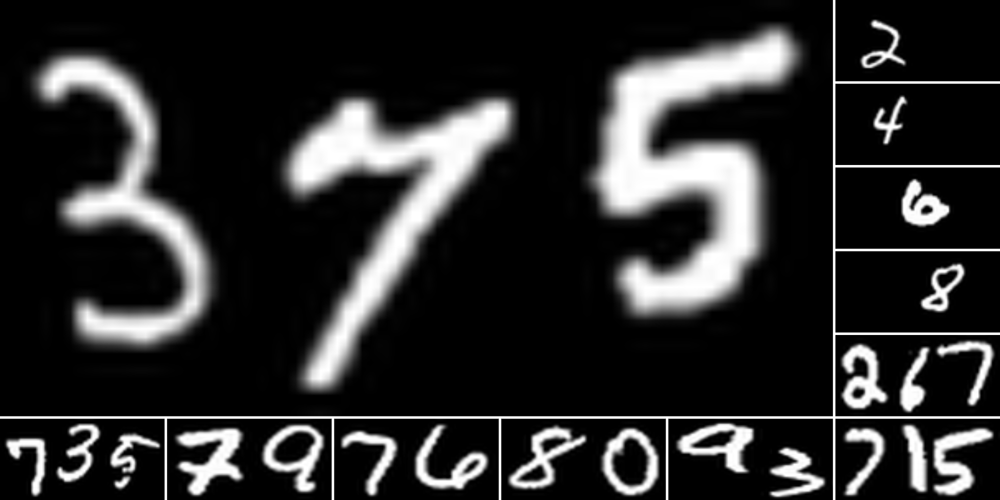

# MNIST Multi-Digit Image Generator

本项目生成了包含一位、两位和三位数字的 MNIST 数据集与脚本，并提供了相关标签。



## 项目结构

```plaintext
├── gen Data
│   ├── png
│   │   ├── label_id.png       # 生成的图片文件（命名格式：label_id.png）
│   └── label.csv              # 标签文件，包含每个图片的标签
└── script
    └── generate_images.py      # 生成图片的脚本
```

- **genData**：存放生成的图像和标签
  - `png`：包含生成的 MNIST 数字图像，格式为 `label_id.png`，如 `23_1.png` 代表标签为23的图像。
  - `label.csv`：CSV 格式标签文件，包含每张图片的文件名和对应的标签信息。
- **script**：包含用于生成上述数据的脚本

## 数据内容

本项目生成了以下三类图像数据：

1. **一位数字图像**：共 60,000 张。
2. **两位数字图像**：共 50,000 张。
3. **三位数字图像**：共 50,000 张。

所有图像均已生成在 `genData/png` 文件夹下，对应的标签在 `genData/label.csv` 中。

- 每个图片大小为 100 x 50

> **备注：因为图片文件过多，上传到 `GitHub` 有困难，现在已经传输到 `kaggle` 上，请查看[kaggle 数据集](https://www.kaggle.com/datasets/weimingfeng/multi-digit-mnist-dataset)**

## 使用指南

### 1. 环境要求

安装依赖：
```bash
pip install torch torchvision pillow tqdm matplotlib
```

### 2. 生成图像

在 `script` 目录中，我们提供了生成图像的脚本 `generate_images.py`。可以通过以下命令运行此脚本：

```bash
python script/generate_images.py
```

### 3. 标签文件格式

`label.csv` 的内容格式如下：

| filename    | label |
|-------------|-------|
| 23_1.png    | 23    |
| 5_345.png   | 345   |
| 8_7.png     | 7     |
| ...         | ...   |

- `filename` 列表示图像文件名。
- `label` 列表示图像对应的数字标签。

## 示例

运行脚本后，您将会在 `genData/png` 文件夹中看到以下格式的图片文件：

- `genData/png/45_2.png`，其中 `45` 是标签，`2` 是图片的唯一标识符。
- `genData/label.csv` 将包含每张图片的标签信息。